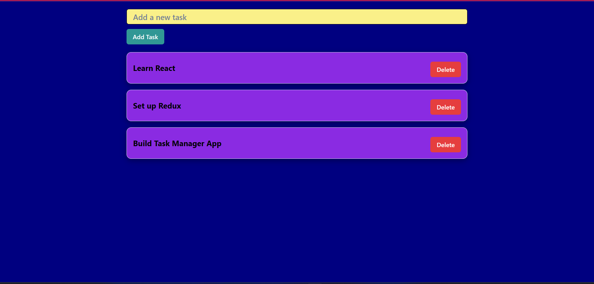

# Task Manager

# Description:

The Task Manager Application is a simple, responsive web app built with React, Chakra UI, and Redux, following the MVC architecture. The application allows users to manage tasks by adding, viewing, and deleting them. It showcases essential React concepts, including state management with Redux, component structure, form handling, and lifecycle methods, along with modern features like code splitting and lazy loading.

## Key Features:

## 1. Add, View, and Delete Tasks:

    - Users can add tasks via a controlled form, view them in a task list, and delete them with a single click.

## 2. State Management with Redux:

    - Global state is managed with Redux, ensuring seamless handling of tasks across different components.

## 3. Chakra UI for Styling:

    - Chakra UI is used to design a clean, responsive, and accessible user interface. The application adapts to different screen sizes, including mobile, tablet, and desktop.

## 4. Lifecycle Hooks:

    - React lifecycle hooks (such as useEffect) are used to manage component behavior during mounting and unmounting, simulating data fetching and cleanup processes.

## 5. Controlled and Uncontrolled Components:

    - The task input form is a controlled component, and there's a demonstration of uncontrolled components using refs.

## 6. Code Splitting with React.lazy():

    - Components are loaded lazily using React.lazy() and Suspense, improving performance by reducing the initial load time.

## 7. Predefined Tasks:

    - The app starts with a set of default tasks to demonstrate functionality out of the box.

## 8. Responsive Design:

    - The app is fully responsive, providing a smooth user experience across devices like smartphones, tablets, and laptops.

## Home Page

